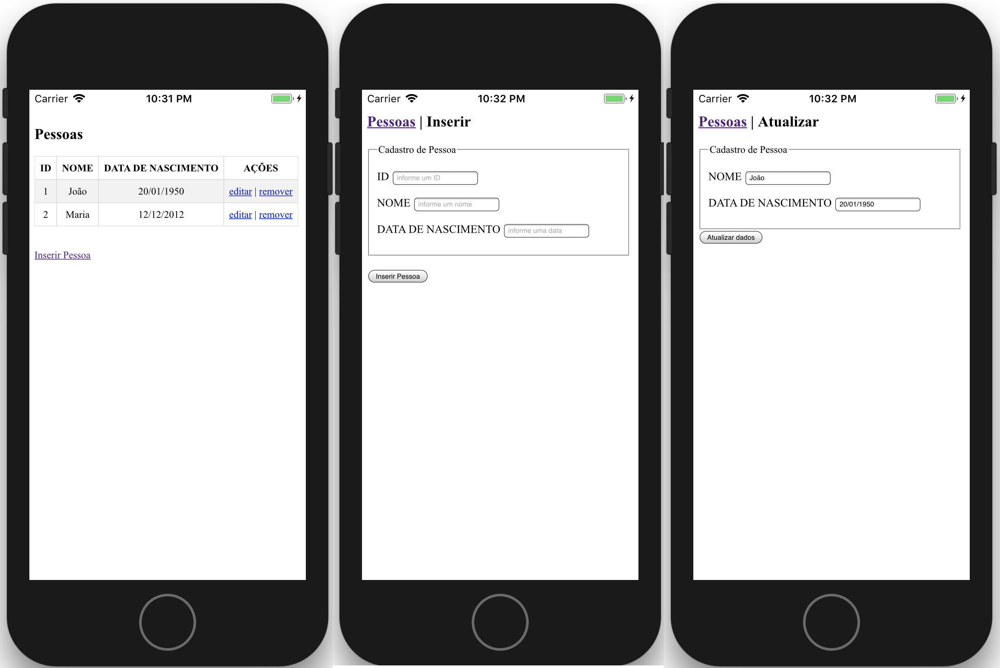

## Aplicativo mobile CRUD completo (Banco de Dados no próprio aparelho)


## Como utilizar
Adicione a plataforma android:
```bash
cordova platform add android
```

Compile o aplicativo:
```bash
cordova build
```

Rode o aplicativo no seu smartphone:
```bash
cordova run android
```

## Plugins utilizados nesse projeto:

Neste projeto foi utilizado o plugin [cordova-sqlite-storage](https://github.com/litehelpers/Cordova-sqlite-storage). Portanto se for utilizar o banco de dados sqlite no seu projeto não esqueça de adicionar o plugin:

```bash
cordova plugin add cordova-sqlite-storage --save
```
