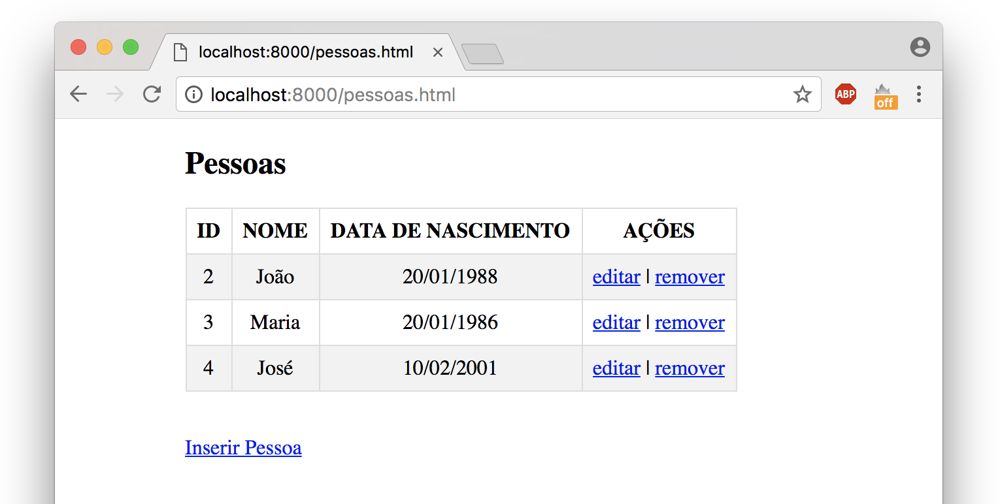

## Aplicação CRUD completa (Banco de Dados e WebService juntos)


## Como utilizar?

Instale as dependências. Na pasta do projeto execute o comando abaixo:
```bash
npm install
```

Levante o servidor. Na pasta do projeto rode o comando abaixo:
```bash
node index.js
```

Teste. Abra no navegador de sua preferência o endereço http://127.0.0.1:8000/ para acessar o webservice.

Se tudo estiver ok, a pagina inicial deve redirecionar para a pagina pessoas.html mostrada na imagem abaixo:

