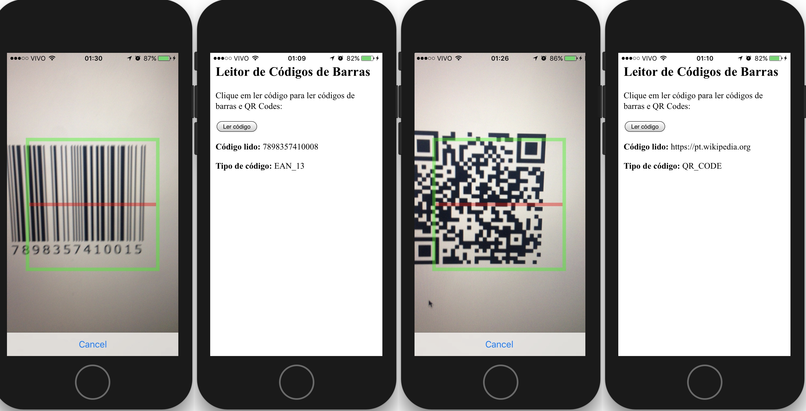

## Aplicativo leitor de códigos de barras e códigos QR



## Como utilizar
Adicione a plataforma android:
```bash
cordova platform add android
```


Compile o aplicativo:
```bash
cordova build
```

Rode o aplication no seu smartphone
```bash
cordova run android
```


## Plugins utilizados nesse projeto

Neste projeto foi utilizado o plugin [phonegap-plugin-barcodescanner](https://github.com/phonegap/phonegap-plugin-barcodescanner) que dá suporte a leitura de vários tipos de códigos de barras e QR codes no iOS e Android. 

Portanto, não esqueça de adicionar o plugin quando for criar um novo projeto que utilize códigos de barras:
```bash
cordova plugin add phonegap-plugin-barcodescanner --variable CAMERA_USAGE_DESCRIPTION="To scan barcodes"
```
