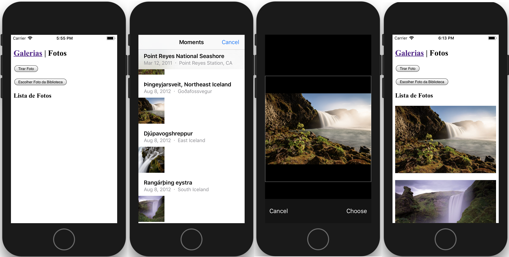
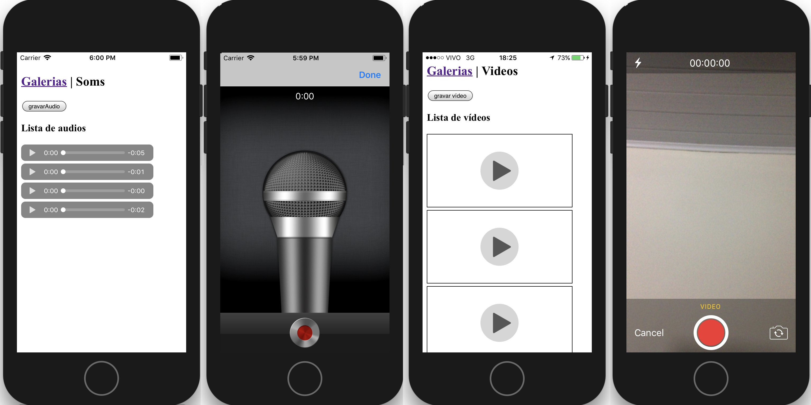

## Aplicativo Galeria (grava fotos, som e vídeo)





## Como utilizar
Adicione a plataforma android:
```bash
cordova platform add android
```


Compile o aplicativo:
```bash
cordova build
```

Rode o aplication no seu smartphone
```bash
cordova run android
```


## Plugins utilizados nesse projeto

Neste projeto foi utilizado os seguintes plugins nativos do cordova:
 * [cordova-plugin-camera](https://cordova.apache.org/docs/en/latest/reference/cordova-plugin-camera/index.html)
 * [cordova-plugin-media-capture](https://cordova.apache.org/docs/en/latest/reference/cordova-plugin-media-capture/index.html)

Portanto, não esqueça de adicionar o plugin quando for criar um novo projeto que utilize captura de audio e video:
```bash
cordova plugin add cordova-plugin-camera
cordova plugin add cordova-plugin-media-capture
```
