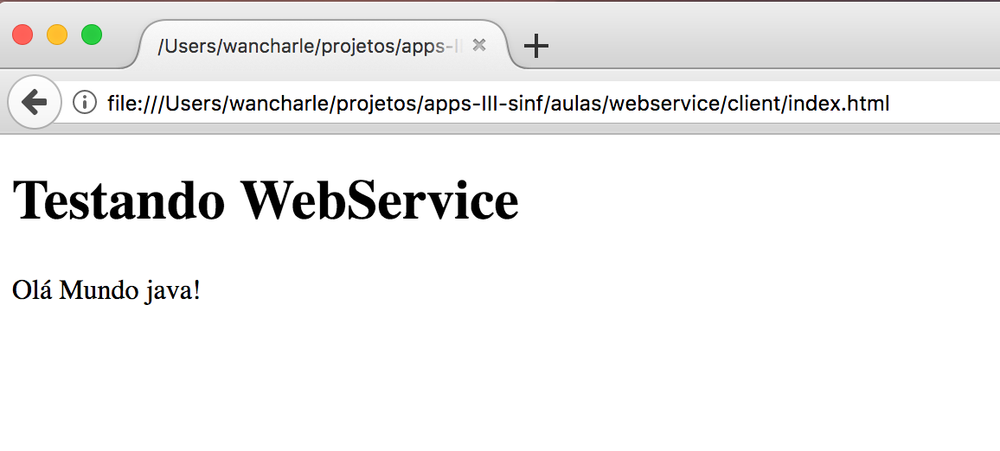
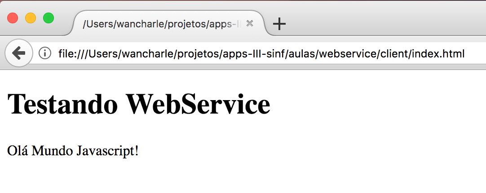
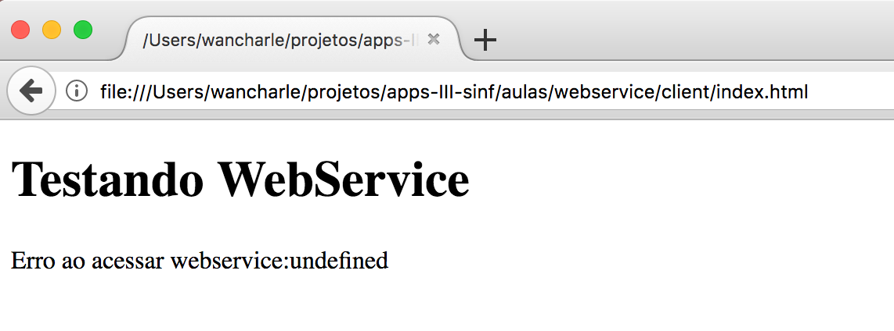

# Criando um cliente para o webservice

Para acessar nosso webservice só precisamos de uma pagina web que utilize o servico $http do angular para obter os dados do webservice.

O código pagina o de acesso do webservice é o seguinte:
```HTML
<!DOCTYPE html>
<html>
    <head>
        <meta charset="UTF-8">

        <script src="angular.min.js"></script>
        <script>
            var app = angular.module('meuApp', []);
            function controlador($scope, $http) {
                $scope.respostaDoWebservice = '' 
                
                function sucesso(response) {
                    $scope.respostaDoWebservice = response.data;
                }
                function erro(response,status) {
                    $scope.respostaDoWebservice = "Erro ao acessar webservice:" + response.statusText + status;
                }
                $http.get("http://127.0.0.1:3000/").then(sucesso,erro);
            }
            app.controller('meuControlador',controlador);
        </script>
    </head>
    <body>
        <div ng-app="meuApp" ng-controller="meuControlador">
            <h1>Testando WebService</h1>
            <p>{{respostaDoWebservice}}</p>
        </div>
    </body>
</html>
```

Utilizamos o seguinte trecho do codigo acima para acessar o webservice:
```javascript 
$http.get("http://127.0.0.1:3000/").then(sucesso,erro);
```

Observe que para utilizar o servico $http do angular tivemos que importar esse servico. Isso foi feito no seguinte trecho:
```javascript 
     function controlador($scope, $http) {
```


## Testando o Webservice

Primeiro levante o servidor web de sua preferência: [node.js](../server/node/) ou [java servlets](../server/java).


Agora abra o arquivo [index.html](index.html) no navegador de sua preferência.


Se vc levantou o servidor java terá a seguinte resposta no navegador:




Se vc levantou o servidor javascript terá a seguinte resposta no navegador:



Mas se vc não conseguir levantar o servidor web ou acontecer algum problema de firewall/proxy, terá a seguinte mensagen:


