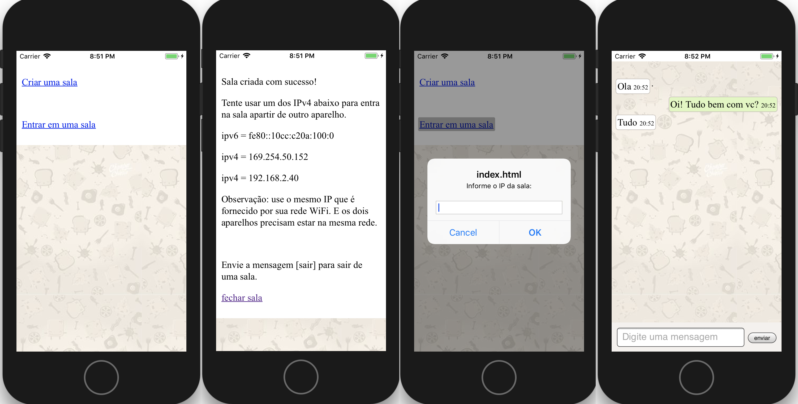

## Aplicativo de troca de mensagens por WebSockets



## Como utilizar
Adicione a plataforma android:
```bash
cordova platform add android
```


Compile o aplicativo:
```bash
cordova build
```

Rode o aplication no seu smartphone
```bash
cordova run android
```


## Plugins utilizados nesse projeto

Neste projeto foi utilizado o plugin [cordova-plugin-websocket-server](https://github.com/becvert/cordova-plugin-websocket-server) que da suporte a websockets no iOS e Android. 

Portanto para ulitizar web sockets no seu projeto não esqueça de adicionar o plugin:
```bash
cordova plugin add cordova-plugin-websocket-server
```

## Como funciona?
Todo o código do aplicativo desse exemplo pode ser visualizado no arquivo [index.html](www/index.html). No entanto, observe que para o código funcionar ainda precisamos incluir algumas dependências:

* A biblioteca Angular.js
* A diretiva [viewport](www/js/viewport.js)
* O service [WebSocketService](www/js/websockets.js)
